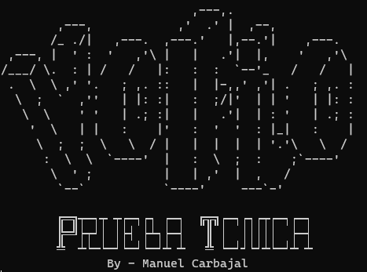

# YoFio - Prueba Técnica

Este es el código creado para la prueba técnica.

## Tecnologías

Para el desarrollo se ha usado __Go versión 1.15__ y __MongoDB__

## Librerias

Para hacer este REST API usé las siguientes librerias.
- __Gorilla Mux__: Para realizar el ruteo de los endpoint e indicar el método HTTP con el que se puede ingresar al endpoint.
- __Mongo Official Driver__: Utilizado para hacer la conexión con la base de datos de MongoDB
- __Testify__: Libreria para tests unitarios y mocking que contiene una libreria de asserts

## Prerequisitos

Para el uso de esta API es necesario tener instalado Go de preferente la versión 1.15 y MongoDB. Tambien se requiere tener
las siguientes variables de ambiente (enviroment variables):

- __MONGO_URI__: Debe contener la URI con la que se realiza la conexión a la base de datos de MongoDB. Por ejemplo:
    - ```mongodb://localhost:27017/```
    - ```mongodb+srv://<username>:<password>@cluster0.d8yoe.mongodb.net/<database>?retryWrites=true&w=majority```
- __PORT__: Indica el puerto por el cual será desplegado el servicio. Este puerto debe ser valido. Por ejemplo:
    - 8000
    - 9000
    - 5000
    - etc...

## ¿Cómo iniciar?

Solo se necesita correr el comando de go ```go build``` para crear el ejecutable e iniciarlo desde terminal o prompt.
De igual forma, se puede correr el modulo main con ```go run main.go```.

Lo primero que mostrará indicando que se ha iniciado correctamente es un banner de presentación como este:



## ¿Cómo esta organizado el código?

El proyecto esta basado en el patrón de diseño MVC (Modelo-Vista-Controlador), y encontramos los siguientes paquetes:

- __connections__: Aquí se encuentra la lógica para realizar la conexión a MongoDB
- __controllers__: Aquí se encuentra toda la lógica que se encarga de pasar los datos necesarios a los servicios para que se realice el procesamiento.
- __dao__: Aquí se encuentra toda la logica necesaria para interactuar con la base de datos
- __entities__: Aquí están las structs que representan un registro en la base de datos
- __mocks__: Aquí se encuentran todo el código generado para realizar el mocking para las pruebas unitarias (unit testing)
- __models__: Aquí se encuentran las structs que se usan a lo largo del programa. Estas no tienen una relación con la base de datos
- __services__: Aquí se realiza el procesamiento de la información y es donde se encuentra la logica de negocio necesaria.
- __utils__: Aquí se encuentran funciones que se pueden usar en cualquier lugar dentro del programa como el logger.

Esta organización de código tiene como objetivo evitar las relaciones circulares y que sea mas claro que hace cada componente.

## ¿Dónde esta la solución de los Retos?

__Nivel básico:__ *Crea una implementación en Golang que satisfaga la anterior interfaz.*

Este se satisface en el paquete __services__, archivo __credit_assigner.go__ en la struct __CreditAssignerImpl__. Este es el código:

__Nivel Intermiedio:__ *Crea una API REST,Crea una API REST...*

Esto se satisface con la lógica de los paquetes __controllers__ con la struct y método __CreditControllerImpl.HandleCreditAssignment__. En __services__ con la struct y método __CreditAssignerImpl.Assign__.
Como detalle, este struct CreditAssignerImpl tiene como dependencia cualquier implementación de la interfaz ```type InvestmentFilter interfaz {Filter(quantity int32, credit1, credit2, credit3 *entities.CreditDetails) (e error)}``` pensado para que se puedan implementar diferentes filtros y delegar la lógica solo para que el método __Assign__ haga el consumo.

Para la solución del problema en un comienzo quize crear un buffer channel para realizar la disminución de la cantidad de inversión para hacerla pedazos mas pequeños y faciles de calcular. Esto para aumentar la velocidad del proceso. 
Esto no lo implemente porque no encontre la forma de ir disminuyendo la cantidad gradualmente hasta 0.

En su lugar lo que realice fue:
1. Reviso que la inversion recibida sea divisible entre alguno de los créditos.
2. Si sí, entonces se comienza con el decremento de la inversión por cada cantidad de crédito hasta que la inversión llegue a 0 capturando cada decremento que se hace por cada crédito manteniendo el contador.
3. Si no, se obtienen los miles y las centenas restantes.
4. Se revisa si el restante es divisible entre las cantidades de los créditos.
5. Si sí, se realiza el punto dos con la cantidad de las centenas
6. se realiza el punto dos con la cantidad de los miles

Aquí se encuentra la URL donde se encuentra desplegado el proyecto: https://yo-fio-prueba-tecnica.herokuapp.com/

__Nivel Avanzado:__ *Crear una base de datos para almacenar las asignaciones...*

Esto se satisface con la lógica de los paquetes __controllers__ con la struct y método __CreditControllerImpl.HandleGetStatistics__. En __services__ con la struct y método __CreditDetailsServiceImpl.GetStatistics__.

El proyecto se creo usando TDD (Test Driven Development) y se cobrió un %93 porciento del código. El %7 restante son por el manejo de errores al insertan datos a la base.
Para las pruebas de integración las realice algunas peticiones al servicio de forma local y en la URL https://yo-fio-prueba-tecnica.herokuapp.com/ con Postman.

## Conclusión

Espero esta solución a la prueba técnica sea de su agrado y espero poder estar en contacto con ustedes para poder continuar con un proceso de selección.

Sin mas por el momento agradezco su tiempo para leer este README.

